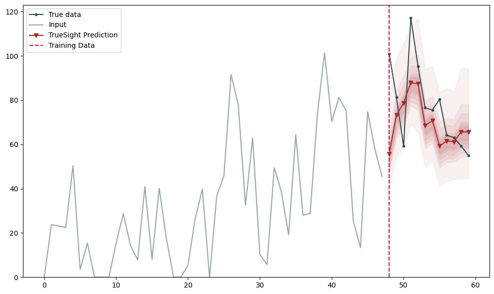

# TrueSight ✨

The TrueSight model is a hybrid forecasting tool that uses statistical forecasting models together with a Deep Neural Network (DNN) to make predictions. The TrueSight `Preprocessor` class is responsible for getting all the statistical forecasters in one place. It can handle forecasters from packages like `statsforecast`, `scikit-learn`, `pmdarima`, and others. You just need to the `ModelWrapper` Class to standardize the method calls.

All you need to do before using this package, is create a pandas dataframe with the following structure:

 - unique_id: A string that uniquely identifies each time series in the dataframe
 - ds: A datetime column with the date of each time step. The dates must be in the correct frequency for the date_freq parameter
 - y: The values of the time series

and run the steps in the Usage section. Easy peasy! 😎

## Instalation 💻

To install the TrueSight package, just run:

```
pip install truesight
```

We also recommend installing the `statsforecast` package for the statistical forecasters:

```
pip install statsforecast
```

## Usage 🚀

Import the necessary modules

``` python
import tensorflow as tf
from truesight.preprocessing import Preprocessor
from truesight.core import TrueSight
from truesight.metrics import Evaluator, smape, mape, mse, rmse, mae
from truesight.utils import AutoTune, generate_syntetic_data
```

Load the data

``` python
num_time_steps = 60
season_length = 12
forecast_horizon = 12
df = generate_syntetic_data(num_time_steps, season_length, 100)
```
Create and run the preprocessor class. You can include as many statistical models as you need in the `models` parameter, just make sure to use the `ModelWrapper` class. However, keep in mind that more models mean longer processing time. It's important to set a fallback model in case any of the informed models fail to fit.

``` python
from statsforecast.models import SeasonalNaive, AutoETS
from sklearn.linear_model import LinearRegression
from truesight.models import AdditiveDecomposition
from truesight.utils import ModelWrapper

models = [
    ModelWrapper(LinearRegression, horizon=forecast_horizon, season_length=season_length, alias="LinearRegression"), 
    ModelWrapper(SeasonalNaive, horizon=forecast_horizon, season_length=season_length), 
    ModelWrapper(AutoETS, horizon=forecast_horizon, season_length=season_length),
    ModelWrapper(AdditiveDecomposition, horizon=forecast_horizon, season_length=season_length)
]

preprocessor = Preprocessor(df)
X_train, Y_train, ids_train, X_val, Y_val, ids_val, models = preprocessor.make_dataset(
    forecast_horizon = 12, 
    season_length = 12,
    date_freq = "MS", 
    models = models, 
    fallback_model = ModelWrapper(SeasonalNaive, horizon=forecast_horizon, season_length=season_length),
    verbose = True
    )
```

Create the model and automatical automatically find the hyperparameters

``` python
optimizer = tf.keras.optimizers.Adam
hparams, optimizer = AutoTune(optimizer=optimizer).tune(X_train, Y_train, n_trials = 20, epochs = 10, batch_size = 32, stats_models = models)
ts = TrueSight(models, forecast_horizon)
ts.set_hparams(hparams)
ts.compile(optimizer=optimizer, loss='mse')
```

Or set then manually

``` python
optimizer = tf.keras.optimizers.Adam
ts = TrueSight(models, forecast_horizon, filter_size = 128, context_size = 512, hidden_size = 1024, dropout_rate = 0.1)
ts.compile(optimizer=optimizer, loss='mse')
```

Train the model, as the model is built on the tensorflow framework, any tensorflow callback can be used

``` python
callbacks = [
    tf.keras.callbacks.EarlyStopping(patience = 100, restore_best_weights = True, monitor = "val_loss"),
    tf.keras.callbacks.ReduceLROnPlateau(monitor = "val_loss", factor = 0.5, patience = 25, verbose = False),
]
ts.fit(
    x = X_train, y = Y_train, 
    validation_data = [X_val, Y_val], 
    batch_size = 128, 
    epochs = 1000, 
    verbose = False, 
    callbacks = callbacks,
)
ts.plot_training_history()
```


Evaluate the results

``` python
yhat = ts.predict(X_val, n_repeats = 100, n_quantiles = 15, verbose = False)
evaluator = Evaluator(X_val, Y_val, yhat, ids_val)
evaluator.evaluate_prediction(evaluators = [smape, mape, mse, rmse, mae], return_mean = True)
```
| metric |   value   |
|-------:|----------:|
|smape   |   0.234369|
|mape    |   0.293816|
|mse     | 816.238082|
|rmse    |  21.218396|
|mae     |  15.885432|


``` python
evaluator.plot_exemple()
```

