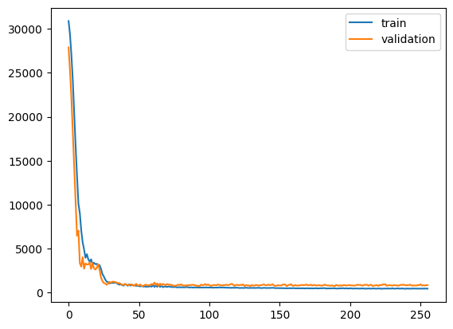

# TrueSight ✨

The TrueSight model is a hybrid forecasting tool that uses statistical forecasting models together with a Deep Neural Network (DNN) to make predictions. The TrueSight `Preprocessor` class is responsible for getting all the statistical forecasters in one place. It can handle forecasters from packages like `statsforecast`, `scikit-learn`, `pmdarima`, and others. You just need a class that accepts the `seasonal_length` parameter for the constructor and has a `.fit(x, y)` method

All you need to do before using this package, is create a pandas dataframe with the following structure:

 - unique_id: A string that uniquely identifies each time series in the dataframe
 - ds: A datetime column with the date of each time step. The dates must be in the correct frequency for the date_freq parameter
 - y: The values of the time series

and run the steps in the Usage section. Easy peasy! 😎

## Instalation 💻

To install the TrueSight package, just run:

```
pip install truesight
```

We also recommend installing the `statsforecast` package for the statistical forecasters:

```
pip install statsforecast
```

## Usage 🚀

Import the necessary modules

``` python
import tensorflow as tf
from truesight.preprocessing import Preprocessor
from truesight.core import TrueSight
from truesight.metrics import Evaluator, smape, mape, mse, rmse, mae
from truesight.utils import get_input_shapes, generate_syntetic_data
```

Load the data

``` python
num_time_steps = 60
seasonal_lenght = 12
forecast_horizon = 12
df = generate_syntetic_data(num_time_steps, seasonal_lenght, 100)
```
Create and run the preprocessor class. You can include as many statistical models as you need in the `models` parameter. Just make sure they follow the syntax similar to `statsforecast`. However, keep in mind that more models mean longer processing time. It's important to set a fallback model in case any of the informed models fail to fit.

``` python
from statsforecast.models import SeasonalNaive, AutoETS
from truesight.models import AdditiveDecomposition

preprocessor = Preprocessor(df)
X_train, Y_train, ids_train, X_val, Y_val, ids_val, models = preprocessor.make_dataset(
    forecast_horizon = 12, 
    season_length = 12,
    date_freq = "MS", 
    models = [AdditiveDecomposition, AutoETS, SeasonalNaive], 
    fallback_model = SeasonalNaive,
    verbose = True
    )
```

Create the model

``` python
input_shapes = get_input_shapes(X_train)
truesight = TrueSight(models, input_shapes, forecast_horizon = forecast_horizon)
truesight.auto_tune(X_train, Y_train, X_val, Y_val, n_trials = 50, batch_size = 512, epochs = 5)
```

Use the `auto_tune` to automatically define the hyperparameters

``` python
truesight.auto_tune(X_train, Y_train, X_val, Y_val, n_trials = 10, batch_size = 512, epochs = 5)
```

Or set then manually

``` python
truesight.set_hparams(lstm_units=256, hidden_size=1024, num_heads=8, dropout_rate=0.1)
```

Train the model, as the model is built on the tensorflow framework, any tensorflow callback can be used

``` python
callbacks = [
    tf.keras.callbacks.EarlyStopping(patience = 100, restore_best_weights = True, monitor = "val_loss"),
    tf.keras.callbacks.ReduceLROnPlateau(monitor = "val_loss", factor = 0.5, patience = 25, verbose = 1),
]
truesight.fit(
    X_train, Y_train, 
    X_val, Y_val, 
    batch_size = 128, 
    epochs = 1000, 
    verbose = False, 
    callbacks = callbacks,
 )
truesight.plot_history()
```



Evaluate the results

``` python
Y_hat = truesight.predict(
    X_val, 
    batch_size = 500, 
    n_repeats = 100, 
    n_quantiles = 15, 
    return_quantiles = True, 
    verbose = False,
 )
evaluator = Evaluator(X_val, Y_val, Y_hat, ids_val)
evaluator.evaluate_prediction([smape, mape, mse, rmse, mae], return_mean=False)
```
| id |         mse |      rmse |      mae |
|---:|------------:|----------:|---------:|
| 10 |  1164.51    |  34.1249  | 25.9397  |
| 13 |     2.91094 |   1.70615 |  1.69313 |
| 18 |     2.62309 |   1.6196  |  1.5549  |
| 38 |     2.77819 |   1.66679 |  1.62896 |
| 45 |   892.701   |  29.8781  | 10.0897  |
| 46 |     2.96284 |   1.72129 |  1.71549 |
| 50 |  3585.54    |  59.8794  | 49.0362  |
| 51 | 12199.1     | 110.449   | 93.9491  |
| 53 |     2.6345  |   1.62311 |  1.56625 |
| 54 |     2.77184 |   1.66488 |  1.63493 |
| 61 |   303.464   |  17.4202  | 14.6694  |
| 67 |     2.70393 |   1.64436 |  1.60988 |
| 69 |  2578.09    |  50.7749  | 38.986   |
| 70 |     3.09074 |   1.75805 |  1.75805 |
| 73 |     2.80945 |   1.67614 |  1.65109 |
| 75 |     2.88333 |   1.69804 |  1.68085 |
| 78 |     3.09091 |   1.7581  |  1.7581  |
| 81 |     2.64539 |   1.62647 |  1.56712 |
| 83 |   491.263   |  22.1644  | 18.4432  |
| 86 |     2.84002 |   1.68523 |  1.64177 |

``` python
evaluator.plot_exemple()
```

